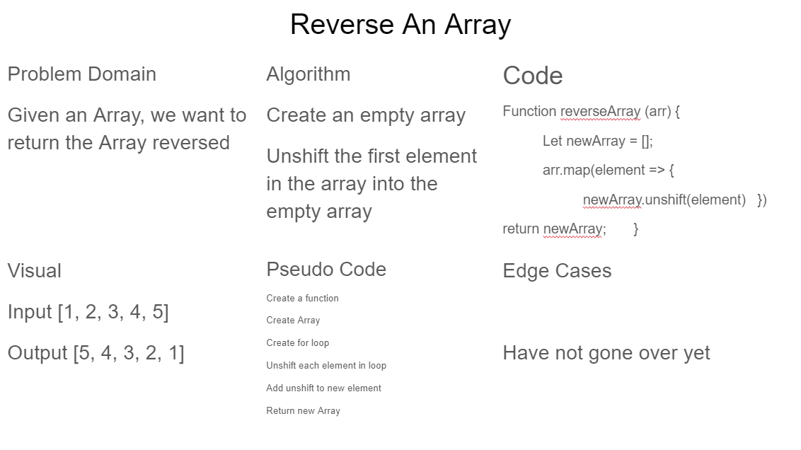

# Reverse an Array

For this challenge we need to reverse an array and return the array reversed.

## Whiteboard Process

## Approach & Efficiency

In this approach I took the way of creating a new array, and using unshift to push the first element of the array into the new array. This will create our reserve array for us.
