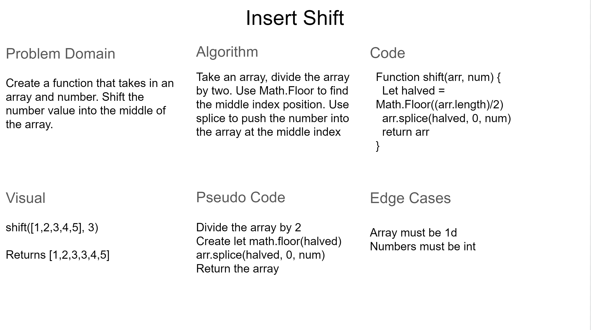

# Insert Shift

We want to be able to take an array, and push a new element into that array in the middle.

## Whiteboard Process

## Approach & Efficiency

The approached I used for this was splice. By using splice we can effectly choose where we want to add the new element in this case it would be halved, we delete nothing, and place our parameter num in the middle.
