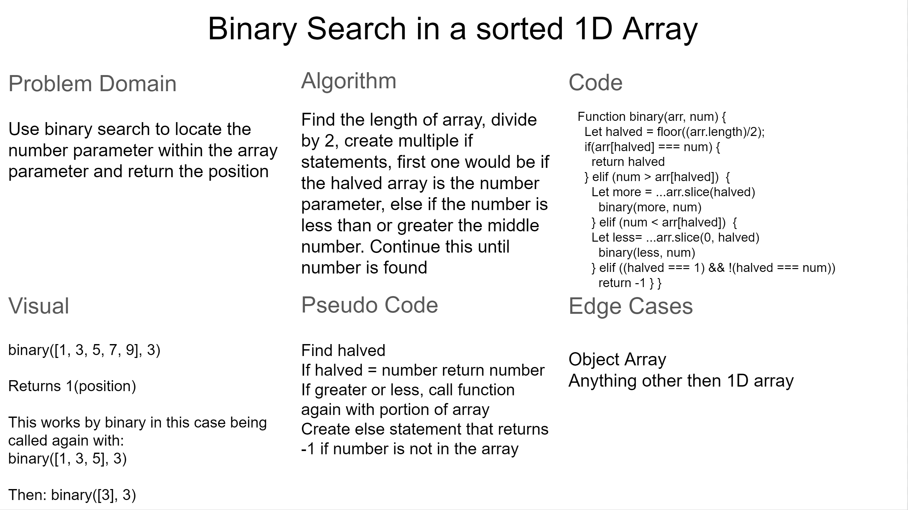

# Binary Search

We need to search through an array and find a number while using a binary search method. So this incase we want to use recurive functions.

## Whiteboard Process

## Approach & Efficiency

For this apprach I used recursive functions. We will create a base function and check to see if when we find the middle, if that is the number we are looking for, if not then we will see if it is greater or less. Once we know, then we will call the function again with the new array if it was greater or less. When we come to only one element left in the array, and the element is not our number, we want to return -1 as our parameter number is not inside of our array.
