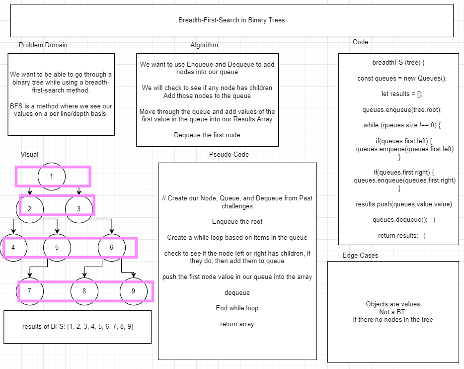

# BFS

Breadth-First-Search is a way to progress through a Binary Tree. Its main purpose to see the values by row basis, or children rows.

The way you check to see these is actually not traversing through the tree like other methods. We use a lot of queues and dequeue. 

Using Enqueue we can add the parent, then the children. Then we can look into our queue, add our values into an array, then dequeue after adding the values making us now see the children. When we go to the parent/children, we first see if they have children, if they do, add them to the queue and continue through until there no more children in the tree.

With this method we can be very far away in a diagram view, but still access the parent/children we need.

## Testing

For our testing, first clone down the repo, do an `npm i` to install the nessessary packages. Then run `npm run test bfs.test.js` to see our test

## Whiteboard

## Contributors

- [BFS Guide](https://medium.com/swlh/traversing-trees-breadth-first-and-depth-first-searches-with-javascript-316f23c9fe8f)
