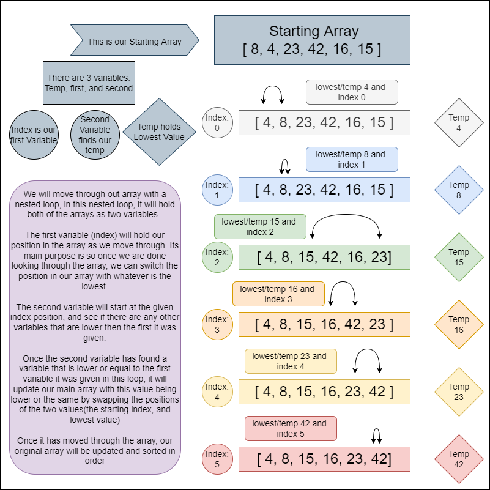

# Sort

## Assignment

Create a detailed explaination of how our sorting function is working along with a diagram that explains step by step process.

## Useage

Our function InsertionSort will take in array, and it will sort the values from lowest to greatest with a BigO of Time: O(n^2) and Space: O(1).

Below we have a detailed image of what our sorting function is doing.

>A quick explaination would be, a nested loop is moving through out array, and each time the deeper nested loop is trying to find a the lowest value from the value given in the index postion it was given, then it was will switch places to re-create our array in a sorted fashion.

## Functionality

## Testing

To run Test

`npm run test sort.test.js`

In our test we will be testing a few things. 

Sort Function
- [x] Works
- [x] Does not return back original array passed through 
- [x] Array has value
- [x] Passed argument is an array
