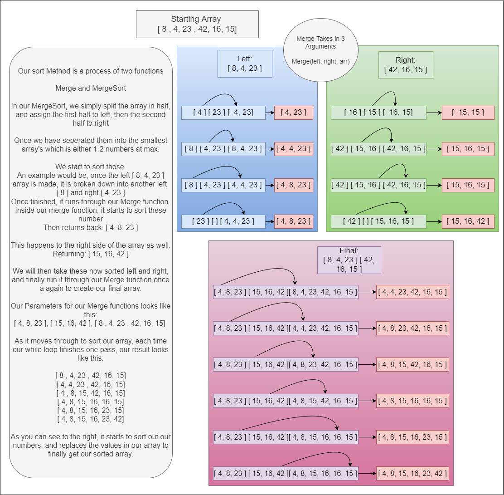

# MergeSort

>In our challenge today, we want to be able to sort the values of an array from given pseudo code and create a visual diagram of the step by step process along with unti tests

## Sorting

```
Our sort method has two functions. One is to break up the array in two smaller arrays naming them left and right.

It will return the sorted values in each side to finally be sorted one last time with our two main left and right arrays.

As our while loop moves through our arrays, it takes in the position of each left and right, and since the starting index will always ahave the smallest value, it will compare the first two values and replace the value in our array with the smallest value. 

Then it will increment which side was smallest, then compare the next values in the array.

Once this is all done, we will finally have a sorted array with the smallest values at the lowest index incrementing to the highest value.
```

## Visual



## Testing

```
To run our Test

npm run test mergeSort.test.js

Our test will cover:
```

- Success of our function
- If nothing in the Array is passed in
- If something besides an array in passed in
- If our function did not sort our values
