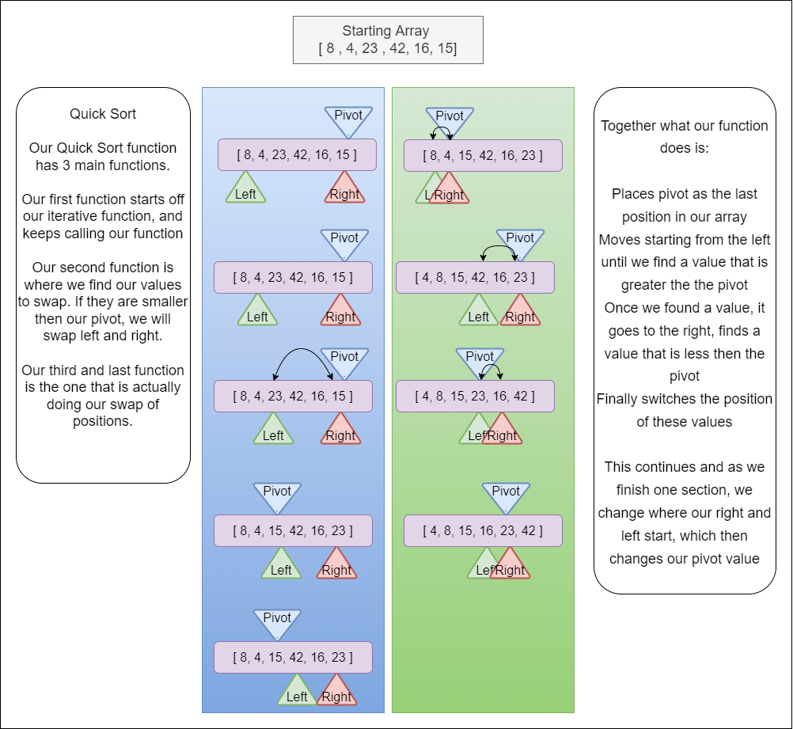

# Quick Sort

## UML

- 

## Usage

>The usage of quick sort, is to be able to quickly sort through an array and return back an sorted array. The reason why we use quick sort over the JS method of sort is that depending on the browser you are using, they have a different method. And some of those methods dont scale well in performance if you have a large dataset. Being able to create your own sort function, you have the control of how fast it moves, and know what kind of speed and space to expect.

## Time and Space

```
Time: O(N*log(n))

Space: O(n)
```

## Testing

Running `npm run test` will run our test to show our tests:

- Sorted Array
- Sorted Array is not the same as original unsorted array
- Array is passed through
- There is data in our arrays
- Different size Arrays

## Resources

- [QuickSort in JS](https://www.guru99.com/quicksort-in-javascript.html)
- [QuickSort in 4 minutes](https://www.youtube.com/watch?v=Hoixgm4-P4M&ab_channel=MichaelSambol)
- [Geeks for Geeks QuickSort](https://www.geeksforgeeks.org/quick-sort/)
- [Geeks for Geeks Iterative QuickSort](https://www.geeksforgeeks.org/iterative-quick-sort/)
