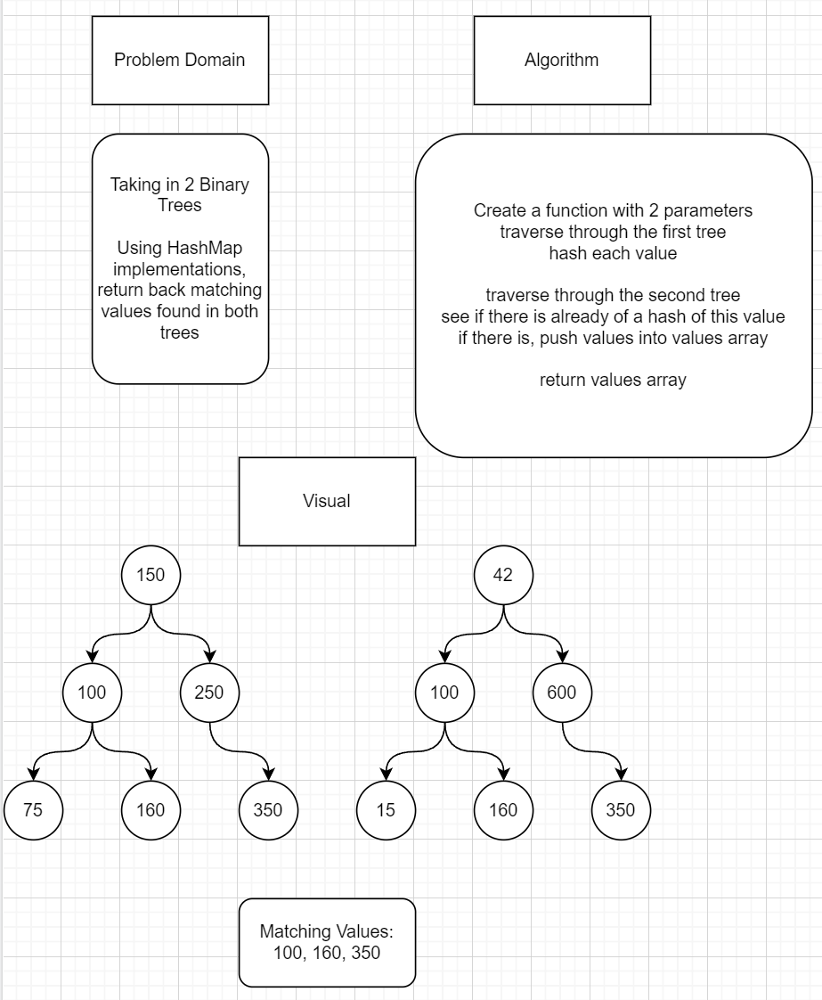

# Tree Intersection

Taking in two binary trees as parametes, along side of Hashmap implementations. Return a set of values found in both trees.

## img 

## Testing

We are testing:

- Get correct results 
- Not return an empty array
- Return false if bad arugments are passed
