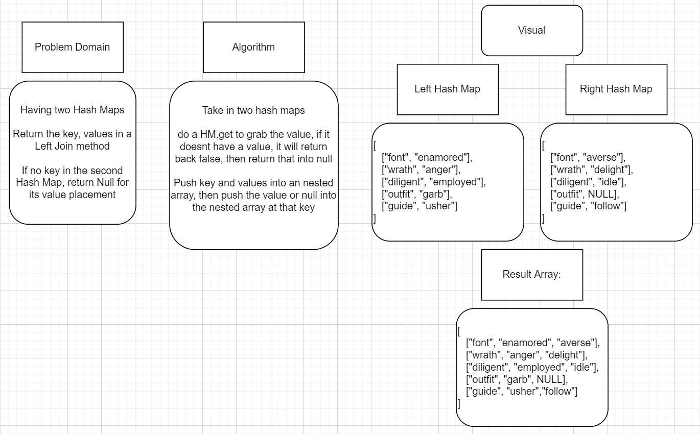

# Left Join Hash Table

Taking in two Hash Tables as parametes, we want to left join them and return back an array of the key, and values of the first Hash Table, and values of the second if they have the same key.

## img 

## Testing

We are testing:

- Get correct results 
- Not return an empty array
- Return false if bad arugments are passed
