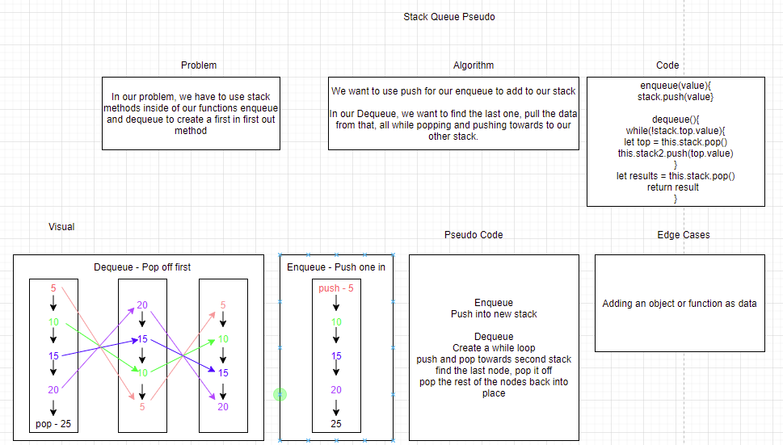

# Challenge Summary

We want to use the functionality of a queue, but use stack functions to create a first in and first out format.

## Whiteboard Process

## Approach & Efficiency
The big o for this is bigO(n^2).

## Solution
By running `node stack-queue-pseudo.js` in the root folder of lib, we can run the code and see our results.
